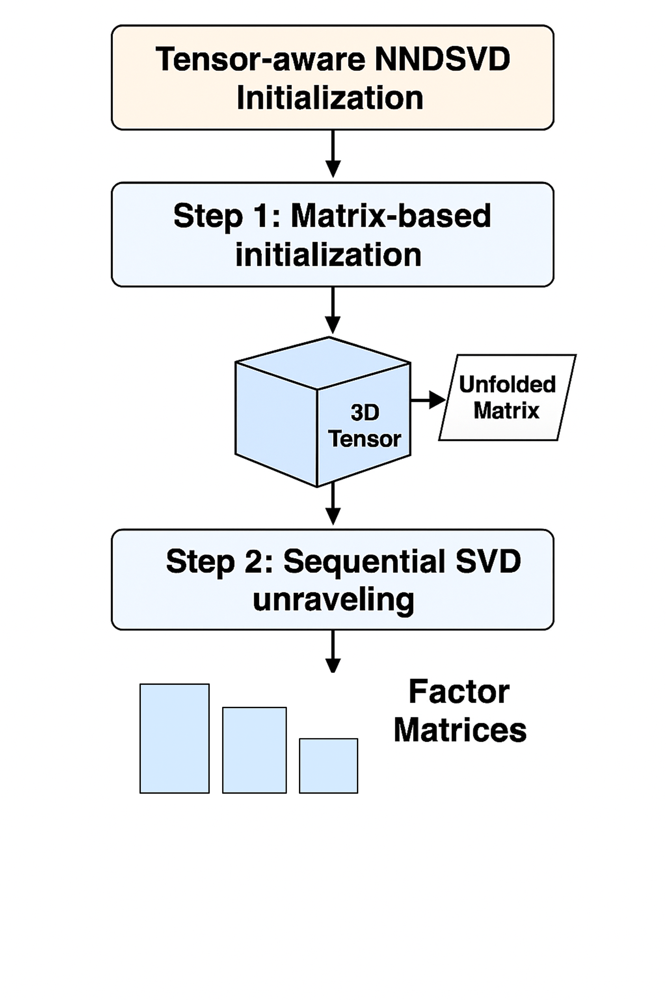
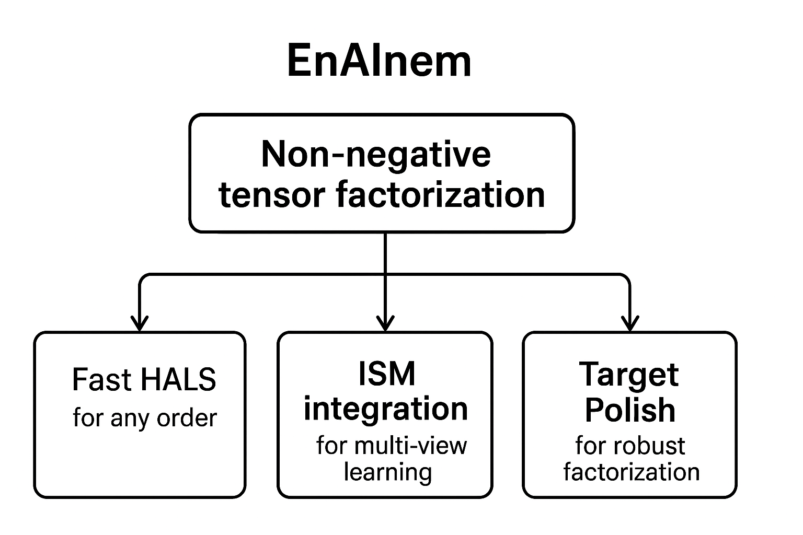

# Summary

EnAInem is a Python package for decomposing non-negative multiway arrays and heterogeneous multi-view datasets into rank-1 nonnegative tensors. It extends scikit-learn’s NMF framework to support tensor factorization (NTF), robust modeling via Target Polish, and integration of incomplete or noisy views using the Integrated Sources Model (ISM). EnAInem is designed for scalable, interpretable machine learning in domains like survival analysis, clustering, and visualization.

> EnAInem internally calls scikit-learn’s `_update_cdnmf_fast` C function, which performs coordinate descent updates for NMF. This ensures EnAInem inherits the same computational efficiency as its ancestor.

> EnAInem is released under the MIT License.

# Statement of Need

Modern datasets often contain multiple views or modalities, each offering distinct perspectives on the same observations. Traditional matrix factorization techniques struggle to capture shared latent structures across such views, especially when data is noisy or incomplete. EnAInem addresses this gap by offering:

- Non-negative tensor factorization for multiway data [@cichocki2009fast]
- ISM for integrating heterogeneous views [@fogel2024ism]
- Robustness to outliers via Target Polish [@fogel2025targetpolish]
- Random completions for missing data (experimental)

These capabilities are critical for applications in health analytics, bioinformatics, and social sciences, where interpretability and robustness are paramount.

EnAInem has been successfully applied to survival analysis in the CoxNTF framework [@fogel2025coxntf], demonstrating its utility for joint clustering and prediction. This application highlights EnAInem’s ability to extract interpretable latent structures from multiway clinical data, supporting both visualization and outcome modeling.

> These methods are described in more detail in the Functionality section below.

# Functionality

EnAInem provides a suite of tools for scalable and interpretable decompositions of multiway and multi-view data:

- **Fast HALS for tensors of any order** [@cichocki2009fast]: Implements Hierarchical Alternating Least Squares (HALS) for efficient non-negative tensor factorization. This method generalizes NMF to higher-order tensors and is known for its fast convergence under non-negativity constraints.

- **Tensor-aware NNDSVD Initialization**

  To support robust initialization for higher-order tensors, EnAInem extends the classical NNDSVD method using a structured two-step approach:

  - **Step 1: Matrix-based initialization**  
    The input tensor is unfolded along the axis with the largest dimension, producing a matrix view. NNDSVD is then applied to this matrix to initialize the factor matrix corresponding to that axis via standard NMF.

  - **Step 2: Sequential SVD unraveling**  
    For the remaining dimensions, and for each component, EnAInem performs rank-1 SVDs across the tensor’s modes in descending order of their dimensionality. This sequential process “unravels” the structure of the tensor, yielding coherent initializations for all factor matrices.

  This strategy preserves the interpretability and sparsity benefits of NNDSVD while generalizing it to higher-order data structures, making it suitable for tensor decomposition tasks, as illustrated in the following diagram:

<p align="center">
  
</p>

Inputs include multiway tensors and multi-view matrices. These are processed through Fast HALS, ISM integration, Target Polish, and optional Random Completions. The outputs include factor matrices, latent representations, and relative error metrics.

- **C-level performance via scikit-learn’s optimized gradient descent**: EnAInem leverages scikit-learn’s `_update_cdnmf_fast` C function, which implements coordinate descent updates for NMF. This allows EnAInem to match the speed and scalability of scikit-learn’s native routines.  
  A small benchmarking experiment comparing both implementations on a synthetic matrix (`10000 × 1000`, `n_components=10`) yielded:  
  ```
  === Performance Comparison ===
  scikit-learn NMF:   5.691 sec | Rel. Error: 0.5979
  EnAInem (NMF mode): 5.753 sec | Rel. Error: 0.5979
  ```
  This confirms that EnAInem achieves identical reconstruction quality while maintaining competitive performance.  
  For full reproducibility, see the `compare_performances` notebook included in the package, which details the benchmarking setup and results.

- **ISM integration for multi-view learning** [@fogel2024ism]: The Integrated Sources Model (ISM) enables joint factorization of multiple heterogeneous views by learning a shared latent representation. It is particularly effective when views are noisy, incomplete, or measured on different scales.

- **Target Polish for robust factorization** [@fogel2025targetpolish]: Offers resistance to outliers and corrupted data through robust loss functions including CIM, Huber, L1, and L21 norms. These options allow users to tailor the decomposition to the noise characteristics of their data.

- **Random Completions for missing data**: An experimental feature that performs multiple random imputations followed by ensemble decomposition using ISM, NMF, or averaging. This approach is useful for exploratory analysis of datasets with missing values, though it is disabled by default.

- **Scikit-learn compatible API**: EnAInem follows the estimator design pattern used in scikit-learn, exposing methods like `fit_transform`, `get_param`, and `set_param`. It inherits scikit-learn’s NMF base classes, ensuring consistent parameter validation, input checking, and seamless integration into ML pipelines.

# EnAInem Workflow

The following diagram illustrates the core components of EnAInem and how they interact to process multiway and multi-view data:

<p align="center">
  
</p>

Inputs include multiway tensors and multi-view matrices. These are processed through Fast HALS, ISM integration, Target Polish, and optional Random Completions. The outputs include factor matrices, latent representations, and relative error metrics.

## Installation

To install EnAInem from source, follow these steps:

1. **Clone the GitHub repository into a new directory**:
  To clone the repository into a local directory of your choice, run the following commands in your terminal:

    ```bash
    mkdir <clone_directory>
    cd <clone_directory>
    git clone https://github.com/Advestis/enAInem.git
    cd enAInem
    ```
  
  Replace <clone_directory> with the path or name of the directory where you want to clone the repository. 


2. **Install the package**:

    ```bash
    pip install .
    ```


3. **(Optional) Install development dependencies**:

    If you plan to contribute or run tests, install the development extras:

    ```bash
    pip install .[dev]
    ```

4. **Using enAInem within a project with a virtual environment**

    If you plan to use `enAInem` within a project that has its own virtual environment, activate the environment and install the package from the local clone:


    ```bash
    pip install /absolute/path/to/enAInem
    ```

    Replace `/absolute/path/to/enAInem` with the actual path to the cloned repository.


> **Note**: EnAInem requires **Python ≥ 3.11**. Ensure your environment meets this requirement before installation.

# Usage

EnAInem supports tensor input (`np.ndarray`):

```python
import numpy as np
from enainem import EnAInem

# Simulate a 3-way tensor (e.g., patients × genes × timepoints)
X = np.abs(np.random.randn(100, 50, 10))  # ensure non-negativity

# Instantiate and fit the model
model = EnAInem(n_components=5)
result = model.fit_transform(X)

# Access factor matrices and reconstruction error
A, B, C = result["A"], result["B"], result["C"]
print("Relative error:", result["relative_error"])
```

EnAInem also supports multi-view input as a list of matrices (`list[np.ndarray]`):

```python
views = [np.abs(np.random.randn(100, 20)), np.abs(np.random.randn(100, 30))]
model = EnAInem(n_components=4)
result = model.fit_transform(views)
```

# Handling Missing Data

EnAInem includes an experimental feature for handling missing values via Random Completions. This functionality is disabled by default: any dataset containing missing values (e.g., `NaN`) will be rejected unless explicitly allowed.

To activate this feature, set the `force_all_finite` parameter to `False` when instantiating the `EnAInem` class:

```python
from enainem import EnAInem

model = EnAInem(n_components=5, force_all_finite=False)
result = model.fit_transform(X_with_missing_values)
```

When enabled, EnAInem performs multiple random imputations and integrates the resulting decompositions using ISM, NMF, or averaging. This approach is under active development and should be used with caution.

# Examples

- `simple_ntf.py`: Demonstrates tensor decomposition with synthetic data  
- `simple_ism.py`: Shows ISM integration across noisy views  
- `coxntf_demo.ipynb`: Demonstrates joint clustering and survival prediction using EnAInem within the CoxNTF framework [@fogel2025coxntf]

# Dependencies

- Python ≥ 3.11  
- NumPy, SciPy, pandas, scikit-learn, Dask  
- Optional: Matplotlib, IPython, pytest

# Acknowledgements

EnAInem builds on scikit-learn’s NMF infrastructure and is supported by Advestis (ForvisMazars R&D). It incorporates algorithms from:

- Fast HALS for NMF/NTF [@cichocki2009fast]  
- Integrated Sources Model [@fogel2024ism]  
- Target Polish for robust factorization [@fogel2025targetpolish]

# References

[@cichocki2009fast]: Cichocki, A., & Phan, A. (2009). Fast Local Algorithms for Large Scale Nonnegative Matrix and Tensor Factorizations. *IEICE Trans. Fundam. Electron. Commun. Comput. Sci.*, 92-A, 708–721. https://doi.org/10.1587/transfun.E92.A.708

[@fogel2024ism]: Fogel, P., Geissler, C., Augé, F., Boldina, G., & Luta, G. (2024). Integrated sources model: A new space-learning model for heterogeneous multi-view data reduction, visualization, and clustering. *Artificial Intelligence in Health*. https://doi.org/10.36922/aih.3427

[@fogel2025targetpolish]: Fogel, P., Geissler, C., & Luta, G. (2025). The Target Polish: A New Approach to Outlier-Resistant Non-Negative Matrix and Tensor Factorization. arXiv:2507.10484

[@fogel2025coxntf]: Fogel, P., Geissler, C., & Luta, G. (2025). *CoxNTF: A New Approach for Joint Clustering and Prediction in Survival Analysis*. arXiv:2506.06411. https://arxiv.org/abs/2506.06411